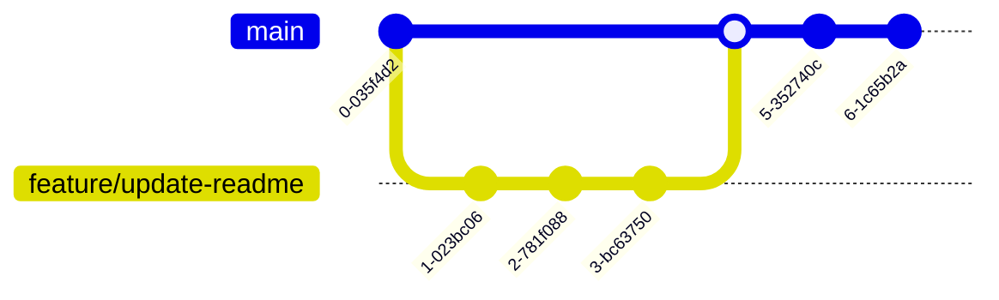

# terraform-aws

AWS のリソースを Terraform で構成する。

## GitHub Actions Status badges

| Name | Environment | Result |
| :--- | :--- | :--- |
| Linterなどによる検証 | Lefthook |  |
| AWS 検証環境 | Sandbox |  |
| AWS ポートフォリオ | Management |  |
| AWS 全体管理 | Management |  |

## ブランチ設計


```mermaid
gitGraph
    commit
    branch feature/update-readme
    commit
    commit
    commit
    checkout main
    merge feature/update-readme
    commit
    commit
```

1. GitHub Flow で運用します。
2. `main` がデフォルトブランチです。
3. `main` ブランチにマージされると GitHub Actions で `terraform apply` でインフラが更新されます。
   - **マージのタイミングがデプロイに相当します。**

## Terraform の構成

- `terraform/envs/`: 環境ごとのルート構成。
- `terraform/modules/`: 共通部品と用途別のモジュール。
  ドメイン、証明書、デプロイ用ロールなどもこのディレクトリで管理します。

## module 化しないリソース

| リソース | 理由 |
| :--- | :--- |
| [aws_iam_role_policy_attachment](https://registry.terraform.io/providers/hashicorp/aws/latest/docs/resources/iam_role_policy_attachment) | パラメータが少なすぎて module 化するメリットがない |
| [aws_route53_record](https://registry.terraform.io/providers/hashicorp/aws/latest/docs/resources/route53_record) | リソースの種類が多く汎用的な module にするコストに見合うメリットがない |

## セキュリティポリシー

### AWS の認証方法

- GitHub Actions から AWS のリソースをデプロイするときの認証方式は OIDC です。
- Credential は管理面の手間がかかるため採用していません。

## EditorConfig 設定

包括的なコーディング規約として EditorConfig を使用しているため、[公式ページの Download a Plugin](https://editorconfig.org/#download) のエディタ・IDE を使用している場合は、プラグインを追加してください。

## AI 開発ツールの共通ルール

Codex、Claude Code、GitHub Copilot、Cursor のルールとスキルは
[共通ルール](docs/rules/overview.md)、[スキルの生成元](.rulesync/skills/)、[rulesync 設定](rulesync.jsonc) で管理します。
Node.js 24 と npm を使用します。macOS・Linux・Windows で同じ npm コマンドを実行できます。

```bash
npm ci
npm run rules:generate
npm run rules:check
```

| ツール | 生成ファイル |
| :--- | :--- |
| Codex | `AGENTS.md` |
| Claude Code | `CLAUDE.md` |
| GitHub Copilot | `.github/copilot-instructions.md` |
| Cursor | `.cursor/rules/overview.mdc` |

ルールを変更するときは `docs/rules/overview.md` を編集し、再生成してください。
スキルの詳細な手順は `docs/rules/<スキル名>.md` に置きます。
`.rulesync/skills/<スキル名>/SKILL.md` には適用条件と原本への参照を記述し、同じコマンドで再生成します。
各ツールのスキルは実行前に原本を読み、手順を複製しません。
スキル専用の原本は YAML メタデータに `targets: []` を指定し、ルールの生成対象から除外します。
`update-gitignore` は Toptal の最新テンプレートから `.gitignore` の生成ブロックを更新するスキルです。
手順の原本は [.gitignore の更新手順](docs/rules/update-gitignore.md) です。
生成先は Codex の `.agents/skills/`、Claude Code の `.claude/skills/`、
GitHub Copilot の `.github/skills/`、Cursor の `.cursor/skills/` です。
生成元・設定・生成ファイルを一緒にコミットします。生成ファイルは直接編集しません。
CI の `rulesync` ジョブで同期漏れを検出します。
個人用の上書き設定 `rulesync.local.jsonc` は Git の管理対象外です。

## Setup

### Repository tasks

タスクの実行には [mise](https://mise.jdx.dev/installing-mise.html) と Bash が必要です。
macOS / Linux では mise をインストールし、リポジトリのルートで次のコマンドを実行します。

```bash
mise trust
mise run install
```

`mise run install` は `setup-repository.sh` を実行します。
`mise install` は mise 自体のツールインストール用コマンドです。
セットアップは同じシェルプロセスで最後まで実行し、GitHub Actions では Homebrew の PATH を後続ステップへ引き継ぎます。

```bash
# Update repository tools
mise run update

# Run checks (complete the Lefthook setup below first)
mise run lint

# Run regression tests (Python 3, Git, and Terraform are required)
mise run test
```

既存の Homebrew は再利用し、未導入の場合のみインストールします。
Rancher Desktop が不要な場合は、CLI ツールのみセットアップできます。

```bash
SETUP_PROFILE=cli mise run install
```

省略時の `SETUP_PROFILE=full` は Rancher Desktop を含む全構成をセットアップします。
セットアップ CI は通常の変更では `cli` を使用し、セットアップスクリプト・タスク・
Terraform バージョン・関連するワークフローやテストの変更では `full` を使用します。
GitHub Actions の `Test Setup Repository Script` を手動実行すると、両 OS の全構成を検証できます。

### Homebrew

```bash
# install brew see: https://brew.sh/index_ja
/bin/bash -c "$(curl -fsSL https://raw.githubusercontent.com/Homebrew/install/HEAD/install.sh)"

# install software
brew bundle
```

### anyenv

#### zsh

```bash
anyenv init
anyenv install --init
echo 'eval "$(anyenv init -)"' >> ~/.zshrc
exec $SHELL -l
mkdir -p "$(anyenv root)/plugins"
git clone https://github.com/znz/anyenv-update.git "$(anyenv root)/plugins/anyenv-update"
```

#### fish

```bash
anyenv init - fish | source
anyenv install --init
set -Ux fish_user_paths $HOME/.anyenv/bin $fish_user_paths
echo 'set -x PATH ~/.anyenv/bin $PATH' >> ~/.config/fish/config.fish
echo 'eval (anyenv init - | source)' >> ~/.config/fish/config.fish
exec fish -l
mkdir -p (anyenv root)/plugins
git clone https://github.com/znz/anyenv-update.git (anyenv root)/plugins/anyenv-update
which anyenv
```

### tfenv

```bash
anyenv install tfenv
which tfenv
```

### Terraform

```bash
tfenv install
which terraform
terraform install
terraform -version
```

### Rancher Desktop

#### Linux

see [Rancher Desktop - Linux](https://docs.rancherdesktop.io/getting-started/installation/#linux)

```bash
curl -s https://download.opensuse.org/repositories/isv:/Rancher:/stable/deb/Release.key | gpg --dearmor | sudo dd status=none of=/usr/share/keyrings/isv-rancher-stable-archive-keyring.gpg
echo 'deb [signed-by=/usr/share/keyrings/isv-rancher-stable-archive-keyring.gpg] https://download.opensuse.org/repositories/isv:/Rancher:/stable/deb/ ./' | sudo dd status=none of=/etc/apt/sources.list.d/isv-rancher-stable.list
sudo apt update
sudo apt install rancher-desktop
```

os reboot.

### Session Manager Plugin

see: [(オプション) AWS CLI 用の Session Manager プラグインをインストールする](https://docs.aws.amazon.com/ja_jp/systems-manager/latest/userguide/session-manager-working-with-install-plugin.html)

#### Linux (Debian | amd64)

```bash
curl "https://s3.amazonaws.com/session-manager-downloads/plugin/latest/ubuntu_64bit/session-manager-plugin.deb" -o "session-manager-plugin.deb"
sudo dpkg -i session-manager-plugin.deb
rm -rf session-manager-plugin.deb
```

### GitHub Actions の SHA 固定

`pinact` は `mise.toml` でバージョンを固定して管理します。
リポジトリのルートでセットアップし、ローカルで Actions を SHA に固定できます。

```bash
mise trust
mise bootstrap
mise exec -- pinact --version

# ワークフローと composite action の参照を SHA に固定
mise exec -- pinact run

# ファイルを書き換えずに固定状態を確認
mise exec -- pinact run --check
```

ツールのインストールだけを実行する場合は `mise bootstrap --only tools` を使用します。
`pinact run` の変更後は差分を確認してコミットしてください。

### Lefthook

```bash
# 検証ツールと Git フックをセットアップ
mise trust
mise install
mise exec -- npm ci
mise exec -- lefthook install

# 全ファイルを検証
mise run lint
mise run test
```

検証には [mise](https://mise.jdx.dev/installing-mise.html) を使用します。
既存の pre-commit フックは `mise exec -- lefthook install` で置き換えます。
`mise run lint` は全ファイル、コミット時はステージ済みファイルを検証します。
安全チェックの Python 依存は uv が初回実行時に取得します。
pre-commit の CLI は不要です。安全チェックは pre-commit-hooks を直接呼び出します。
検証はファイルを自動修正しません。512 KiB のサイズ制限は生成物 `package-lock.json` を除いて適用します。

### ローカルから Terraform CLI を実行する方法

#### AWS Profile の設定

これは下記の `aws-vault exec` コマンドで使用されます。
下記の内容を `~/.aws/config` に設定します。

```bash
[profile terraform-aws-management]
sso_start_url = https://tqer39-management.awsapps.com/start/
sso_region = ap-northeast-1
sso_account_id = 577523824419
sso_role_name = <AWS SSO Role Name>
region = ap-northeast-1
output = json
```

### Terraform のセットアップ

```bash
tfenv install
terraform -v
```

コマンドのフォーマット

- `AWS CLI (SSO) の profile`: 前項で設定した AWS CLI の profile
- `実行先のパス`: Terraform CLI を実行するパス
- `Terraform コマンド`: `terraform` に続くコマンド

```bash
# Format:
aws-vault exec "${AWS CLI (SSO) の profile}" -- terraform -chdir="${実行先のパス}" "${Terraform コマンド}"
```

#### terraform init（初期化）

```bash
# Example:
aws-vault exec terraform-aws-management -- terraform -chdir=./terraform/envs/dev/base_apne1 init
```

#### terraform validate

```bash
# Example:
aws-vault exec terraform-aws-management -- terraform -chdir=./terraform/envs/dev/base_apne1 validate
```

#### terraform plan

```bash
# Example:
aws-vault exec terraform-aws-management -- terraform -chdir=./terraform/envs/dev/base_apne1 plan
```

#### terraform apply

**※ローカルからのデプロイは原則禁止です。**

```bash
# Example:
aws-vault exec terraform-aws-management -- terraform -chdir=./terraform/envs/dev/base_apne1 apply -auto-approve
```

## 新しい環境の作成方法

手動で s3 バケットを作成。
リソースを作成。

```txt
.github/workflows/terraform-aws-<環境名>.yml
.github/labeler.yml
terraform/envs/<環境名>/base/main.tf
terraform/envs/<環境名>/base/provider.tf
terraform/envs/<環境名>/base/terraform.tf
terraform/envs/<環境名>/base/shared-locals.tf
terraform/envs/<環境名>/shared/locals.tf
```

```zsh
# https://xxxxx.awsapps.com/start#/
export AWS_ACCESS_KEY_ID="XXXXXXXXXX"
export AWS_SECRET_ACCESS_KEY="XXXXXXXXXX"
export AWS_SESSION_TOKEN="XXXXXXXXXX"

terraform -chdir=terraform/envs/<環境名>/base init
```

手動で作成した s3 バケットを import。

```zsh
$TF_PATH="terraform/envs/<環境名>/base"
terraform -chdir="$TF_PATH" import module.terraform-backend.module.s3-bucket.aws_s3_bucket.this <バケット名>
terraform -chdir="$TF_PATH" import module.terraform-backend.module.s3-bucket.aws_s3_bucket_acl.this <バケット名>
terraform -chdir="$TF_PATH" import module.terraform-backend.module.s3-bucket.aws_s3_bucket_public_access_block.this <バケット名>
terraform -chdir="$TF_PATH" import module.terraform-backend.module.s3-bucket.aws_s3_bucket_versioning.this <バケット名>
```

OIDC 関連のリソースの新規作成と s3 バケットのパラメータ更新を行います。

```zsh
$TF_PATH="terraform/envs/<環境名>/base"
terraform -chdir="$TF_PATH" fmt
terraform -chdir="$TF_PATH" validate
terraform -chdir="$TF_PATH" plan
terraform -chdir="$TF_PATH" apply -auto-approve
```
